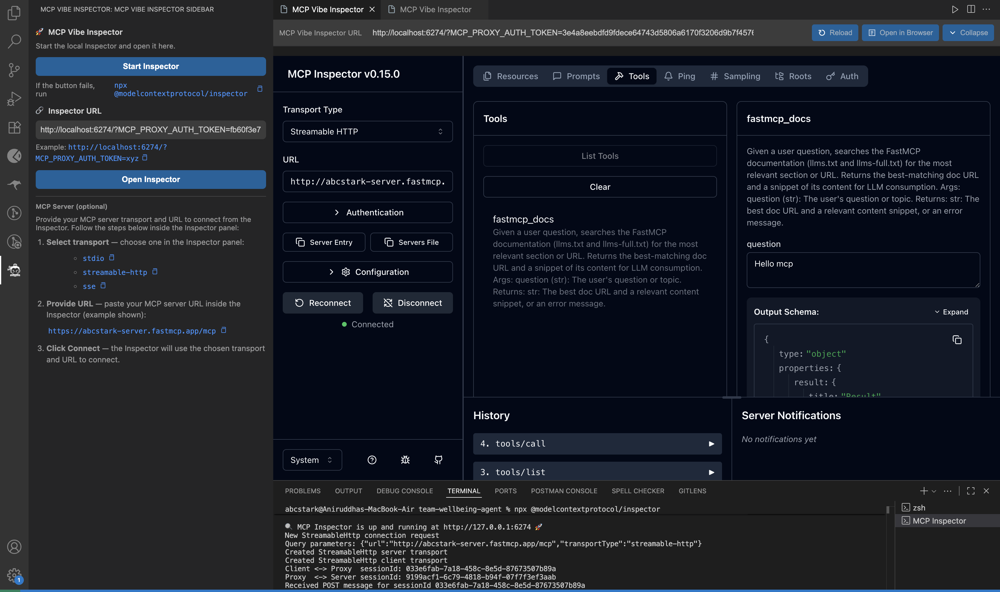
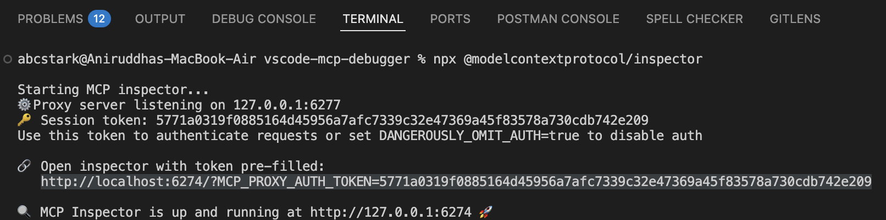
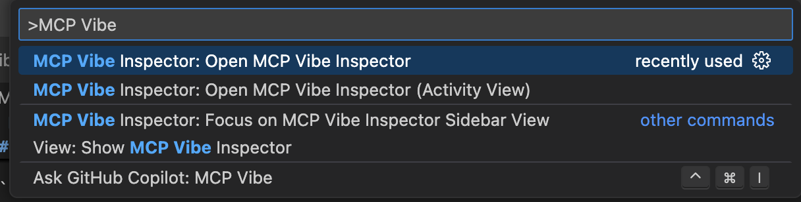

# MCP Vibe Inspector



Debug and inspect Model Context Protocol (MCP) servers right inside VS Code.

This extension embeds the MCP Vibe Inspector in a Webview Panel and provides a lightweight sidebar to quickly configure and launch your Inspector instance—no context switch to the browser needed.

## ✨ Features

- Seamless MCP Vibe Inspector panel inside VS Code
- Sidebar launcher with URL input and client-side validation
- Loading/error overlay to avoid blank screens and provide quick Retry
- Copy-to-clipboard for inline code snippets (icon-only buttons)
- Theme-aware, accessible UI using VS Code design tokens
- Remembers your last URL and panel state
- **NEW in 1.1.0:** Run multiple inspection sessions/tabs at once. Debug and inspect several MCP servers in parallel, each in its own tab for maximum productivity.
- **NEW in 2.0.0:** One-click Start Inspector from the sidebar. The extension will run the Inspector in your integrated terminal (using the exact manual command) and provide a clear fallback copyable command if terminal launch fails.

## 🚀 Getting started

1. **Start the MCP Vibe Inspector with one click:**

- Open the Command Palette (`Cmd+Shift+P` on macOS, `Ctrl+Shift+P` on Windows/Linux) or open the MCP Vibe Inspector sidebar from the Activity Bar.
- Click the **Start Inspector** button in the sidebar. This runs the exact command used in manual workflows in an integrated terminal:

  ```
  npx @modelcontextprotocol/inspector
  ```

- Behavior:
  - The Inspector is launched in your integrated terminal so you can see logs and any authentication tokens that appear in stdout.
  - If the Start button fails to launch the Inspector (rare), use the fallback command above — a copy button is provided next to it in the sidebar for one-click copy.
  - After Inspector starts, copy the Inspector URL from the terminal output (it contains the required MCP_PROXY_AUTH_TOKEN) and paste it into the sidebar input. Click Open Inspector to open the panel.



2. Open the Inspector panel:

- Command Palette → “Open MCP Vibe Inspector”
- Or via the Activity Bar “MCP” view


3. Paste or confirm your Inspector URL in the panel header. Example:

```
http://localhost:6274/?MCP_PROXY_AUTH_TOKEN=…
```

4. Press Enter or click Reload. If loading takes too long, you’ll see a helpful overlay with a Retry action.

## 🧭 Commands

- `MCP Vibe Inspector: Open MCP Vibe Inspector` (mcp-debugger.openInspector)
- `MCP Vibe Inspector: Open MCP Vibe Inspector (Activity View)` (mcp-debugger.openInspectorInView)



## ⚙️ Settings

- `mcpDebugger.inspectorUrl` (string)
  - Default: `http://localhost:3000`
  - The URL where MCP Vibe Inspector is running. Must be http/https and typically includes `MCP_PROXY_AUTH_TOKEN`.

Settings UI: File → Preferences → Settings → search for “MCP Vibe Inspector”.

## 🔧 Troubleshooting

- “Still loading…” overlay appears
  - The Inspector may be slow or unreachable. Verify the URL and network, then use Retry.
- “Failed to load the inspector”
  - Check that your Inspector process is running and accessible from VS Code.
- Invalid URL error
  - Ensure the URL starts with http/https and includes the `MCP_PROXY_AUTH_TOKEN` query parameter when required.

## ❓ FAQ

- Does this extension send telemetry?
  - No. There is no telemetry.
- Can I open in a separate window instead?
  - The extension focuses on an embedded experience; you can still open the same URL in your browser if preferred.

## 🧩 What is MCP?

The Model Context Protocol (MCP) is an open protocol that enables LLM apps to discover and call external tools and data sources. The MCP Vibe Inspector is a debugging UI to explore, validate, and troubleshoot MCP servers.

## 🛠 Development

```bash
git clone https://github.com/abcSTARK/vscode-mcp-debugger
cd vscode-mcp-debugger
npm install
# Press F5 in VS Code to launch the Extension Development Host
```

Build/lint/test:

```bash
npm run compile
npm run lint
npm test
```

## 🤝 Contributing

Issues and PRs are welcome. See `CONTRIBUTING.md` and `CODE_OF_CONDUCT.md`.

## 🔒 Security

Please see `SECURITY.md` for how to report a vulnerability.

## 📄 License

MIT © 2025 abcSTARK
